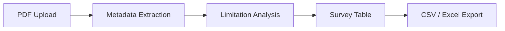

# PaperGrid — Research Paper Mapper

<p align="center">
  
  
  
  
  
  
</p>

<p align="center"><strong>PaperGrid converts research paper PDFs into structured literature survey tables.</strong></p>

<p align="center">
  A premium research workflow for uploading papers, extracting key metadata, reviewing limitations, and exporting clean survey-ready tables.
</p>

---

## Preview


---

## Problem

Literature survey work is slow, repetitive, and highly manual. Researchers often spend hours reading PDFs, copying paper details, organizing comparisons, and rebuilding the same tables over and over.

---

## Solution

PaperGrid streamlines the entire workflow:

Upload PDFs → extract metadata → review and edit records → analyze limitations → export a survey table.

It turns unstructured research papers into a clean, searchable, and exportable literature mapping workspace.

---

## Key Features

| Feature | What it does |
| --- | --- |
| PDF upload | Upload research paper PDFs directly into the workspace |
| Metadata extraction | Detects title, year, authors, method, dataset, metrics, result, and limitation |
| Limitation Intelligence | Captures explicit limitations and falls back to inferred limitations when needed |
| Survey table | Displays all extracted papers in a structured literature review table |
| Search and filter | Quickly find papers by title, method, dataset, metrics, or year |
| Edit and delete | Manually refine extracted records when needed |
| Detail drawer | View the full metadata for any paper in a compact side panel |
| Export | Download the table as CSV or Excel |

---

## Workflow



---

## Tech Stack

| Layer | Technologies |
| --- | --- |
| Frontend | React, Vite, Tailwind CSS, Axios, Lucide React |
| Backend | FastAPI, Python, PyMuPDF, SQLite, Pandas, OpenPyXL |
| Storage | SQLite database |
| Export | CSV and Excel |

---

## Project Structure

```text
PaperGrid/
├── backend/
│   └── main.py
├── frontend/
│   ├── src/
│   └── package.json
└── README.md
```

---

## Setup Instructions

### 1) Clone the repository

```bash
git clone https://github.com/Rupayan147/PaperGrid.git
cd PaperGrid
```

### 2) Backend setup

```bash
cd backend
python -m venv venv
```

Activate the virtual environment:

```powershell
.\venv\Scripts\Activate.ps1
```

Install dependencies:

```bash
pip install fastapi uvicorn pymupdf pandas openpyxl python-multipart
```

Run the backend server:

```bash
uvicorn main:app --reload
```

Backend URL:

```text
http://localhost:8000
```

### 3) Frontend setup

Open a new terminal:

```bash
cd frontend
npm install
npm run dev
```

Frontend URL:

```text
http://localhost:5173
```

### 4) Run the app

Keep both terminals running. Open the frontend in your browser, upload a PDF, and start mapping papers.

---

## API Endpoints

| Method | Endpoint | Description |
| --- | --- | --- |
| GET | `/` | Health/status check |
| POST | `/upload` | Upload a PDF and extract paper data |
| GET | `/papers` | Fetch all saved papers |
| GET | `/papers/{paper_id}` | Fetch a single paper |
| PUT | `/papers/{paper_id}` | Update paper details |
| DELETE | `/papers/{paper_id}` | Delete a paper |
| GET | `/export/csv` | Export all papers as CSV |
| GET | `/export/excel` | Export all papers as Excel |

---

## Future Roadmap

- Gemini / OpenAI-powered extraction
- Semantic Scholar integration
- Cross-paper limitation analysis
- Citation graph visualization
- Paper comparison mode
- DOCX / PDF export
- Research clustering and topic discovery

---

## Author

**Rupayan Biswas**

GitHub: [@Rupayan147](https://github.com/Rupayan147)

---

## License

PaperGrid is open source and available for learning, research, and portfolio use.